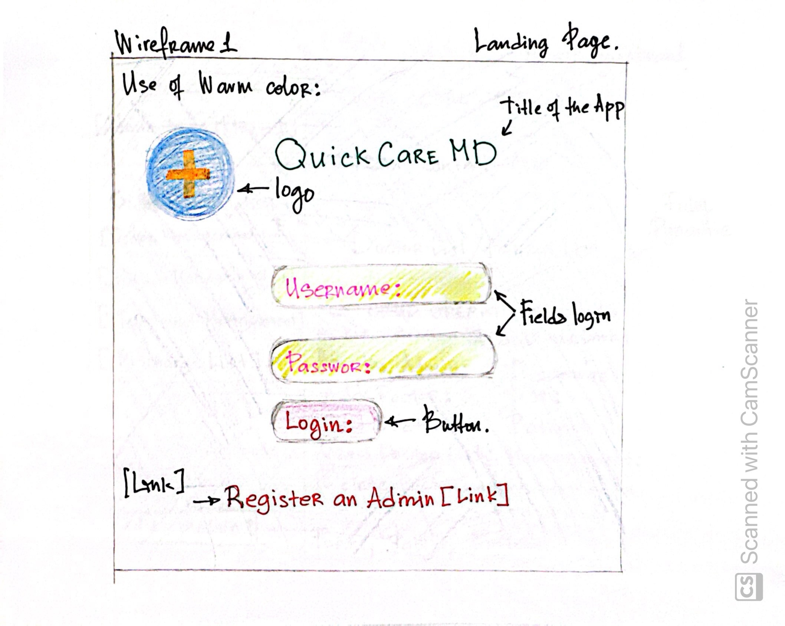
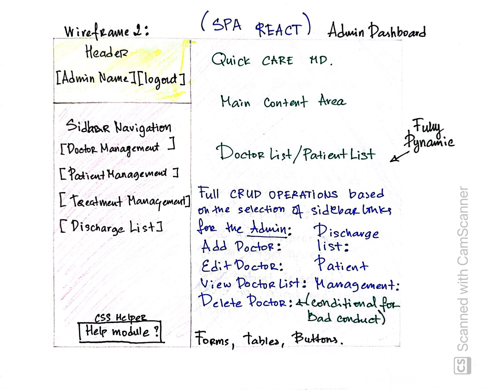
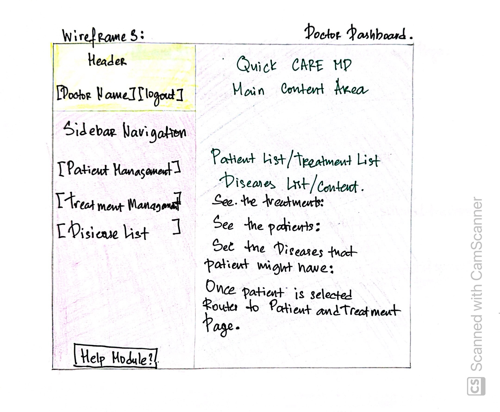
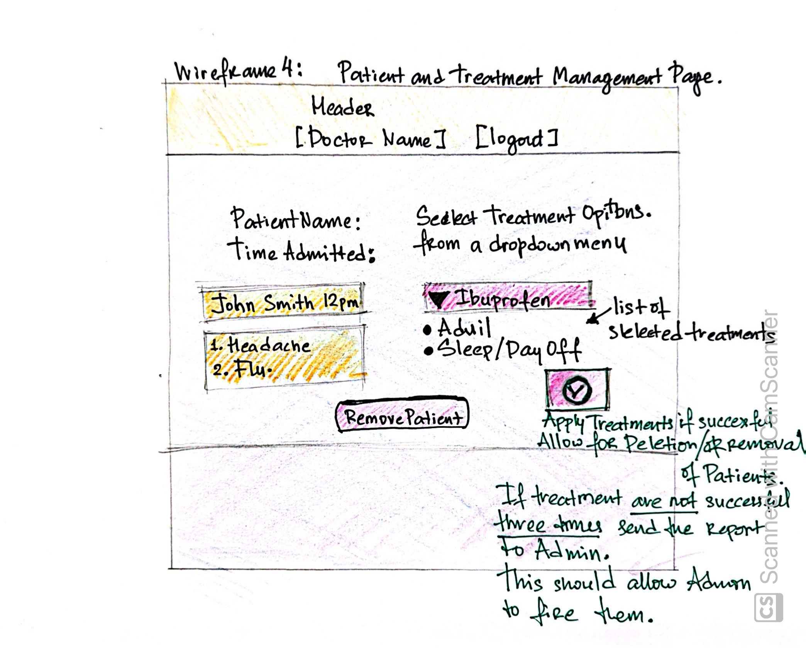

# Project Description

**QuickCareMD** is a **Django / React SPA** walk-in medical App designed to enhance patient-doctor interactions and improve hospital workflow. With QuickCareMD, doctors can efficiently manage patient visits by viewing assigned patients, prescribing medication, and automatically removing treated patients from their dashboard (discharging them) and sending the report to the administration. The App also empowers hospital / administrators to manage the doctor roster, adding or removing doctors as needed to keep operations running smoothly. QuickCareMD ensures patients receive timely care while maintaining a seamless and organized experience for both medical professionals and hospital staff.

## MVP

- As a Hospital / Admin, I want to be able to sign up and sign in.
- As a Hospital / Admin, When I log in, I should be able to see a list of all currently registered doctors.
- As a Hospital / Admin, I want to be able to hire doctors to my Hospital.
- As a hospital / Admin, I want to be able to fire (deactivate) doctors from the Hospital for bad work.
- As a Hospital / Admin, Any doctor removed should no longer have access to the app or patient information.
- As a doctor, I want to be able to sign in to the hospital once I am registered by the Admin
- As a doctor, I can view patient details, including name, diseases, and assign treatments.
- As a doctor, I can prescribe medication to the patient.
- As a doctor, once medication is prescribed, the patient can be removed by the doctor from the system.

## Wireframe of the App






## ERD table for QuickCareMD app


<details>
  <summary>Click here to see the summary of ERD </summary>


</details>

## Django Models

<details>
    <summary>Click here to see the models in Django backend</summary>

```python
class User(AbstractUser):
    ROLE_CHOICES = (
        ('admin', 'Admin'),
        ('doctor', 'Doctor'),
    )
    role = models.CharField(max_length=10, choices=ROLE_CHOICES)

    groups = models.ManyToManyField(
        'auth.Group',
        related_name='custom_user_set',
        blank=True
    )
    user_permissions = models.ManyToManyField(
        'auth.Permission',
        related_name='custom_user_permissions_set',
        blank=True
    )

    def delete(self, *args, **kwargs):
        if self.role == 'admin':
            if Doctor.objects.exists() or Patient.objects.exists():
                raise ValidationError("Cannot delete admin while doctors or patients exist. Please reassign or remove them before proceeding.")
        super(User, self).delete(*args, **kwargs)

class Doctor(models.Model):
    user = models.OneToOneField(User, on_delete=models.CASCADE)
    name = models.CharField(max_length=100)
    incorrect_treatments = models.IntegerField(default=0)  # Track incorrect treatments

    def __str__(self):
        return self.name

    def fire(self):
        """Deactivate the doctor instead of deleting them"""
        if self.incorrect_treatments >= 3:
            self.user.is_active = False  # Deactivate the user account instead of deleting
            self.user.save()

    def delete(self, *args, **kwargs):
        # Prevent deletion if doctor is assigned to any active patients
        if Patient.objects.filter(doctor=self).exists():
            raise ValidationError("Cannot delete a doctor while they have active patients.")
        super(Doctor, self).delete(*args, **kwargs)

class Patient(models.Model):
    name = models.CharField(max_length=100)
    time_admitted = models.DateTimeField(auto_now_add=True)
    disease = models.ManyToManyField('Disease')
    doctor = models.ForeignKey(Doctor, on_delete=models.CASCADE)

    def __str__(self):
        return self.name

class Disease(models.Model):
    name = models.CharField(max_length=100)
    is_terminal = models.BooleanField(default=False)

    def __str__(self):
        return self.name

class Treatment(models.Model):
    patient = models.ForeignKey(Patient, on_delete=models.CASCADE)
    doctor = models.ForeignKey(Doctor, on_delete=models.CASCADE)
    treatment_options = models.TextField()
    success = models.BooleanField(default=False)  # Field to track whether the treatment is correct

    def __str__(self):
        return f"{self.patient.name} - {self.treatment_options}"

    def save(self, *args, **kwargs):
        """Custom save method to check treatment success"""
        if not self.pk:  # New treatment
            super(Treatment, self).save(*args, **kwargs)
            if not self.success:
                self.doctor.incorrect_treatments += 1
                self.doctor.save()
        else:
            # Handle updates to avoid incrementing on every save
            old_treatment = Treatment.objects.get(pk=self.pk)
            if old_treatment.success and not self.success:
                self.doctor.incorrect_treatments += 1
            elif not old_treatment.success and self.success:
                self.doctor.incorrect_treatments -= 1
            self.doctor.save()
        super(Treatment, self).save(*args, **kwargs)

class Discharge(models.Model):
    patient = models.ForeignKey(Patient, on_delete=models.CASCADE)
    discharged = models.BooleanField(default=False)
    discharge_date = models.DateTimeField(auto_now_add=True)  # Track discharge date

    def __str__(self):
        return f"{self.patient.name} - {'Discharged' if self.discharged else 'Not Discharged'}"
```

</details>

## Component Diagram

<details>
<summary> Click here to see component diagram</summary>


## Component Breakdown for Quick Care MD App

| Component           | Description                                                                                 | Role           | Functionality                                          |
| ------------------- | ------------------------------------------------------------------------------------------- | -------------- | ------------------------------------------------------ |
| **Login**           | Allows admins and doctors to log in.                                                        | Admin & Doctor | Validates credentials and redirects based on role.     |
| **Signup**          | Allows the creation of new admin accounts.                                                  | Admin          | Redirects to the login page after a successful signup. |
| **AdminDashboard**  | Central hub for admins, providing access to manage doctors, patients, treatments, and more. | Admin          | Links to various admin functionalities.                |
| **DoctorList**      | Displays the list of doctors.                                                               | Admin          | View, edit, or delete doctors.                         |
| **DoctorForm**      | A form used for creating and updating doctor records.                                       | Admin          | Add new doctors or edit existing ones.                 |
| **PatientList**     | Displays the list of patients.                                                              | Admin & Doctor | View, edit, or delete patients.                        |
| **PatientForm**     | A form used for creating and updating patient records.                                      | Admin & Doctor | Add new patients or edit existing ones.                |
| **TreatmentList**   | Displays the list of treatments for patients.                                               | Admin & Doctor | View and update treatments.                            |
| **TreatmentForm**   | A form used for creating and updating treatment records.                                    | Admin & Doctor | Add new treatments or update existing treatments.      |
| **DiseaseList**     | Displays the list of diseases.                                                              | Admin & Doctor | View available diseases in the system.                 |
| **DischargeList**   | Displays the list of discharged patients.                                                   | Admin          | View all discharged patients.                          |
| **LogoutButton**    | Allows users to log out of the system.                                                      | Admin & Doctor | Ends the user session and redirects to the login page. |
| **DoctorDashboard** | Central hub for doctors, providing access to their assigned patients and treatments.        | Doctor         | View and manage their patients and treatments.         |

</details>

## Path Table (Django)

| Endpoint                | Description                      | HTTP Method      | Action                                          |
| ----------------------- | -------------------------------- | ---------------- | ----------------------------------------------- |
| `/`                     | API Root                         | GET              | Returns API root message                        |
| `/users/register/`      | Register Admin                   | POST             | Create a new admin user                         |
| `/doctors/`             | List/Create Doctors              | GET, POST        | List all doctors / Create a doctor              |
| `/doctors/<int:pk>/`    | Retrieve/Update/Delete Doctor    | GET, PUT, DELETE | Retrieve, update or delete a specific doctor    |
| `/patients/`            | List/Create Patients             | GET, POST        | List all patients / Create a patient            |
| `/patients/<int:pk>/`   | Retrieve/Update/Delete Patient   | GET, PUT, DELETE | Retrieve, update or delete a specific patient   |
| `/diseases/`            | List Diseases                    | GET              | List all diseases                               |
| `/treatments/`          | List/Create Treatments           | GET, POST        | List all treatments / Create a treatment        |
| `/treatments/<int:pk>/` | Retrieve/Update/Delete Treatment | GET, PUT, DELETE | Retrieve, update or delete a specific treatment |
| `/discharges/`          | List Discharges (Admin Only)     | GET              | List all discharges (admin only)                |
| `/token/`               | Obtain JWT Token                 | POST             | Login and retrieve JWT token                    |
| `/token/refresh/`       | Refresh JWT Token                | POST             | Refresh the access token                        |
| `/token/verify/`        | Verify JWT Token                 | POST             | Verify the access token                         |

## MVP Stretch Goals

- The first stretch goal should be FDA Open API for disease and treatment matching (No need for route
  since it is an open and should be callable from front-end)
- Api implementation of the diseases Mayo Clinic and / or National Institute of Health (free API)
- As a Hospital / Admin, I want to see a list of discharged patients.
- As a doctor, I want to have access to the list of discharged patients for record keeping.
- As a Hospital / Admin, I want to be able to hire nurses assigned to a doctor to delegate tasks.
- As a Hospital / Admin I want to be able to evaluate the performance of my doctors.
- As an Admin I want the ability to inform the doctors of their login info securely and via email that
  they will have to provide during their hiriing process.

## Team expectations and roles

> Nuraly - GitHub Repo owner for both backend and front-end.

"Everybody codes nobody retreats,
push and commit, and test often"

> No one - pushes after 6 pm. Do not push to the dev branch unless tested by the team

- Rosevelt - responsble for general style and direction of the app.
- Rodney - responsbile for front-end component implementation.
- Nuraly - project manager, and review of the pull requests.
- Everyfeature branch must be created before coding "git checkout -b"
- Emphaty and communication is the key.

**When in doubt check for Git Commands**

<details>
<summary> Git Cheatsheet </summary>


</details>

## Plan of Attack

|      Day       |               Task               |
| :------------: | :------------------------------: |
|  13th Friday   |   Create and present proposal    |
| 14th Saturday  |    Create backend structures     |
|  15th Sunday   |     Time Off / Research API      |
|  16th Monday   | Begin functions/ Launch Back End |
|  17th Tuesday  | Finalize Backend / _Deployment_  |
| 18th Wednesday |  Begin Front End / _Deployment_  |
| 19th Thursday  |        Continue Front End        |
|  20th Friday   |       Review Stretch Goals       |
| 21st Saturday  |        Finalize Front End        |
|  22nd Sunday   | Time Off / Testing and Bug fixes |
|  23rd Monday   |    Add CSS/ launch front end     |
|  24th Tuesday  |     Implement Stretch Goals      |
| 25th Wednesday |       **Presentation Day**       |

## Day to day plan

[Day to day play](https://trello.com/b/ERUs8q4b/project-management)
